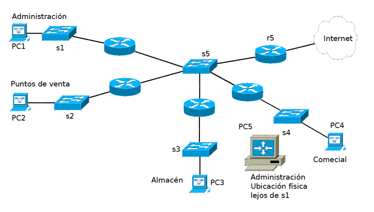
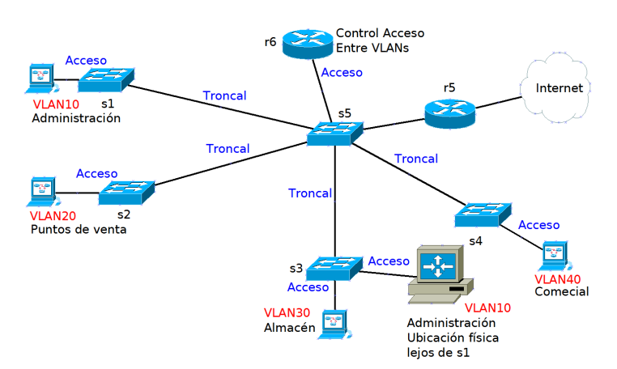

#cisco #vlan

# VLANs

## INTRODUCCIÓN

Las VLANs se configuran siempre en los SWITCHES.

Estándar que define las VLANs: **IEEE 802.1q.**

### **FUNCIONES PRINCIPALES**
- Separar subredes IPv4
- Separar redes físicas diferentes

## REDES SEGMENTADAS CON ==ROUTERS==

>Las redes basadas en routers eran bastante comunes antes de la estandarización de las VLANS, aunque todavía se emplea en algunos lugares

>**FUNCIONES NECESARIAS DE LOS ROUTERS**
> - Separan diferentes redes lógicas, las diferentes redes IP
> - Las difusiones quedan limitadas dentro de una subred IP
> - Control de comunicaciones

>**==DESVENTAJAS==**
> - Además de interconectar redes IP, están realizando función de acceso a la red a los equipos finales
> - El control del tráfico de la red está distribuido entre los diferentes routers, esto **añade** bastante dificultad en la administración _(Puede ser solucionado con un **router CENTRAL**)_
> - La pertenencia a una subred IP determinada depende de la ubicación física
> 	- **EJEMPLO**:
> 	
> 	_PC5 forma parte del dpt. administración, pero por causas organizativas, se tiene que ubicar físicamente lejos del switch de acceso a ese departamento. ¿Cómo se conectaría a esa red?_
> 		
> 	- Con un cable MUY largo (como está muy lejos tendría que ser fibra óptica y ponerlo en algún lugar seguro, etc.)
> 	- Si lo conectamos al switch 3 tendría que pertenecer a la subred IP de almacén
> 	==Este **problema lo viene a solucionar las VLANS** (a parte de muchos otros más)==
> 

## REDES SEGMENTADAS CON VLANS

>
>
>- Los **switches** dan acceso a la rede a los equipos finales, y segmentan la red en subredes lógicas
>- La ubicación física de un equipo **NO IMPORTA**, porque no condiciona su pertenencia a una determinada subred lógica
>- El router r6 controlará la conectividad entre las subredes lógicas

## TIPOS DE INTERFACES EN VLANs

- ACCESS (puerto de acceso)
- TRUNK   (puerto troncal)

### ACCESS
- Hay que **indicar** a **que interfaz** ==**pertenecen**==
- Todas las PDUs que lleguen a un puerto access, serán **etiquetadas** con la VLAN configurada en el **puerto / interfaz**
- Las PDUs que salgan por un puerto de **ACCESO** serán **des**etiquetadas. Se quedarán según el formato estándar (sin VLAN) para que los dispositivos finales la puedean procesar
- Peticiones **UNICAST**: Cuando llega a un puerto de acceso, la PDU se etiqueta con la VLAN corrrespondiente
- Peticiones **BROADCAST**: Cuando llega a un puerto de acceso, se etiqueta con la VLAN correspondiente.

### TRUNK
- Hay que indicar que PDUs podrán salir a través de la interfaz configurada, en función de la VLAN indicada en la PDU
- **PETICIONES** (mismo proceso en los dos casos):
- Peticiones **UNICAST**: 
	- Cuando llega por el puerto troncal, no se realiza ningún cambio en la PDU
	- La PDU es reenviada por todos los puertos ASOCIADOS a la VLAN de acceso y troncales que estén asociados o permitan la VLAN de la PDU
- Peticiones **BROADCAST**:
	- Cuando llega por el puerto troncal, no se hace nigún cambio en la PDU
	- La PDU es reenviada por todos los puertos asociados a la VLAN de la PDU, de acceso y troncales que estén asociados o permital la VLAN de la pdu

## ==BUENAS PRÁCTICAS==

1. Dejar la **Default VLAN** SIN puertos asociados 
2. **Desactivar** los puertos no utilizados
3. Crear una **VLAN Black Hole** y asociarle los **puertos que no se están utilizando**
4. Establecer una **VLAN diferente de la 1** para ==**Administración del switch**==
5. Establecer una **VLAN diferente de la 1** como ==**VLAN nativa**==
6. Establecer la **misma VLAN nativa** en los ==**dos extremos**==  **de un enlace trunk**
