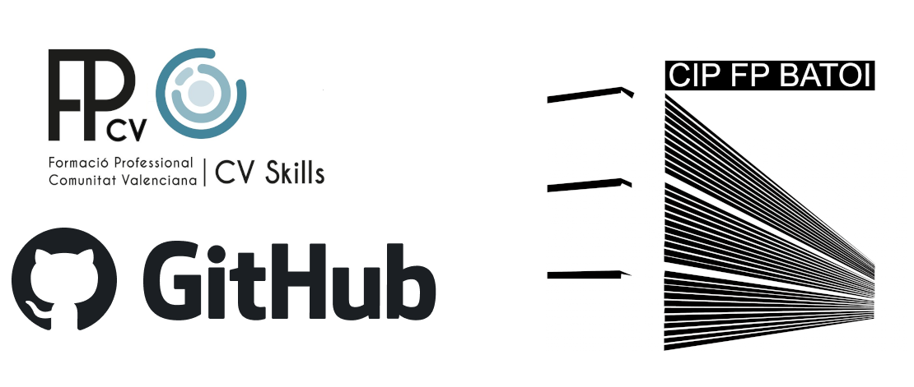

tags: #CVSKILLS 

# INTRODUCCIÓN

Este repositorio intentará abarcar todas las areas de la informática las cuales entran en el campeonato de CV-SKILLS.

PDF:  [PDF-ANTECEDENTES](asir-desc-tecnica.pdf)

---

## CONFIGURACIÓN EN LINUX SERVER
- Configuración del sistema
- [RAID](SERVICES/RAID/RAID.md)
- LVM
- [Cifrado de disco](SERVICES/CIFRADO-DISCOS/CRYPTSETUP.md)
- Configuración de red
- Acceso remoto (SSH)
- NAT
- Firewall ([nftables](NFTABLES.md))
- [DHCP](SERVICES/DHCP/THEORY/DHCP.md)
- [DNS](SERVICES/DNS/THEORY/DNS.md)
- HTTP (apache2/nginx)
- Mail Server
- Securizar servicios con certificados ([CA](SERVICES/CERTIFICADOS/CA.md) y SSL/TLS)
- Archivos Compartidos (SAMBA)
- LDAP (openldap/slapd)
- Backup (rsync)
- [Fail2Ban](SERVICES/FIREWALL/FAIL2BAN.md)
- Scripting (Shell Scripting)
- [Crontab](SERVICES/CRONTAB/CRONTAB.md)

---

## CONFIGURACIÓN EN WINDOWS SERVER
- Active Directory domain services
- Estructura OU
- Windows DNS
- Windows DHCP
- NAT
- Remote Desktop Services
- Windows Resource Monitor
- Script de powershell para crear usuarios
- Firewall de windows
- windows deployment services
- GPOs
- Perfiles Móviles
- RAID
- DFS
- Backup (Windows Server Backup)
- HTTP (apache, nginx,IIS)
- Securizar servicios con certificados (CA y SSL/TLS)
- Cifrado de discos

---

## CONFIGURACIÓN DE REDES

[Apuntes Cisco](CISCO/intro-cisco.md)

`BY: Miguel García Miró`
