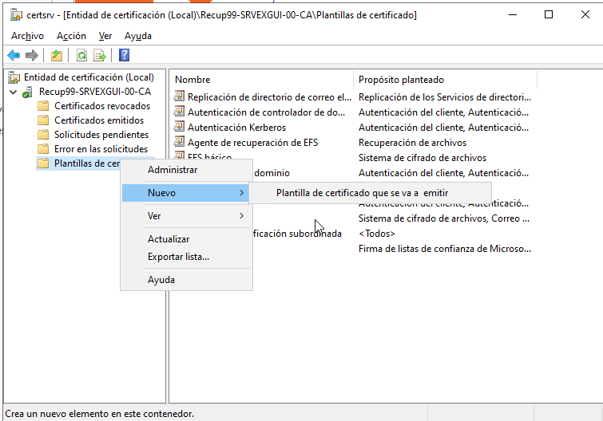
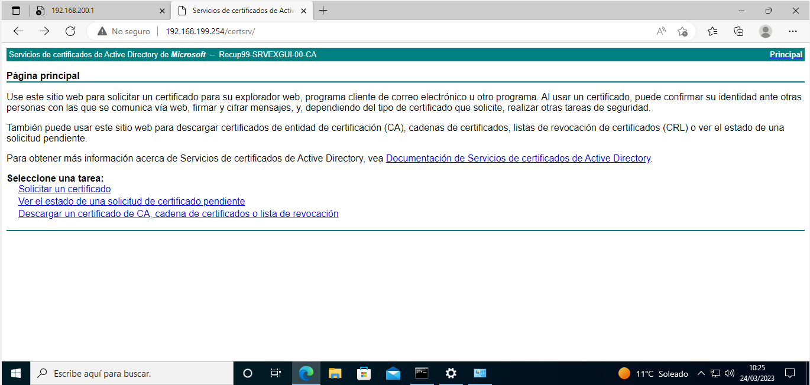

# Entidad certificadora en Windows
Lo montaremos en un solo servidor que actuará como CA Raíz y Emisora. En entornos grandes la recomendación es instalarlo en varios niveles siendo el más alto la CA Raíz que debe estar fuera del dominio y fuera de la red y, una o varias entidades certificadoras subordinada a nuestra CA Raíz que deben pertenecer al dominio. Es recomendable crear tanto un grupo como un usuario especifico que será el administrador de nuestra CA y evitar el uso del Administrador del dominio, aunque nosotros lo haremos con el usario Administrador.

## Instalación
En primer lugar instalremos el rol **Servicio de certificados de Active Directory** (_Active Directory Certificate Services_), con sus características asociadas. En la ventana de _"Selección de rol"_ marcaremos dos roles:
- **Entidad de certificación** (_Certification Authority_), obligatoria
- **Inscripción web de entidad de certificación** (_Certification Authority Web Enrollment_), para que los clientes soliciten su certificado

## Configuración
Una vez instalados los configuraremos (marcamos los 2 roles):
- tipo de entidad certificadora: **Empresarial** (_Enterprise CA_)
- tipo de entidad: **CA raíz** (_Root CA_)
- clave privada: crearemos una nueva clave privada
- criptografía: lo recomendable es elegir SHA256
- nombre de la CA (**_CN_**): por defecto pone el FQDN de nuestro servidor
- periodo de validez del certificado raíz: por defecto 5 años
- localización de las BBDD: pr defecto `C:\Windows\System32\CertLog`

Una vez configurado se gestiona desde la herramienta **_Entidad de certificación_** (también podemos abrirla ejecutando `certsrv.msc`). Dentro de nuestra CA aparecen las carpetas:
- Certificados revocados
- Certificados emitidos: de momento tenemos el emitido a nuestro DC
- Solicitudes pendientes: los certificados pendientes de emitir
- Error en las solicitudes
- Plantillas de certificado: ejemplos de certificado de servidor web, equipo, usuario, ...

Las plantillas de certificado son lo que usaremos para generación y despliegue de certificados. Para usarlas debemos indicar quien las va a administrar. Lo normal sería crear un grupo que se encargue de ello aunque nosotros vamos a usar el de administradores del dominio (_Domain admins._).

No conviene modificar las plantillas sino que podemos duplicar la que nos interese y modificar lo que queramos en la copia. Para ello pinchamos sobre la carpeta con el botón derecho y pulsamos `Administrar`. Se abre la `Consola de plantillas de certificado` y para duplicar una le pinchamos con el botónn derecho y elegimos `Plantilla duplicada`. Ahora cambiamos lo que necesitemos (por ejemplo queremos una plantilla de _servidor web_ para un Windows Server 2022 así que cambiamos el destinatario. También podríamos modificar el nombre de la plantilla, el período de validez, ... Es conveniente cambiar el _Subject name_ para que el nombre no lo indique el solicitante sino que se use automáticamente su CN, y alternativamente el nombre DNS y UPN.

Por último nos queda determinar quién puede solicitar certificados con esta plantilla y quien la puede administrar. Ahora vamos a la pestaña _Seguridad_, añadimos **_Equipos del dominio_** y marcamos _Inscribirse_ y _Autoinscribirse_ para que todos los equipos de dominio puedan solicitar un certificado y puedan inscribirse automáticamente.

También nos aseguraremos que el _Domain Admins._ tenga permisos de lectura y escritura para que pueda administrar esta plantilla.

Para poder usar esta plantilla falta decirle a la CA que puede usarla. Se hace con el botón derecho sobre _Plantillas de Certificado_ escogiendo **`Nuevo -> Plantilla de certificado que se va a emitir`**. Con eso ya nos aparece esta plantilla.

## Solicitar certificado
Si cualquier usuario de nuestro dominio quiere solicitar un certificado puede hacerlo desde su navegador poniento la URL de la CA en la ruta **/certsrv**, por ejemplo **`http://192.168.100.1/certsrv`**:

Si queremos crear una directiva para desplegar certificados para todos los equipos del dominio lo que haremos es: 
1.       Desde un DC abrimos el `Administrador de directivas de grupo`
2.       Desplegamos la rama del dominio, una vez abierta pulsamos botón derecho sobre él y elegimos Create a GPO in this Domain and Link it here. Nos pide el nombre de esta GPO, le damos el que queramos.
3.       Una vez creado la debemos modificar, botón derecho sobre ella y elegimos Edit.
4.       Una vez en la ventana de edición vamos a Computer Configuration / Policies / Windows Settings / Security Settings / Public Key Policies.
5.       Botón derecho sobre “Certificate Services Client – Auto-Enrollment”, propiedadesEn Configuration mode le decimos Enabled y marcamos las dos opciones de renovación y actualización.
6.       Pulsamos OK y cerramos el editor de la GPO.
7.       Por defecto las políticas se filtran por el grupo Aunthenticated Users, en nuestro caso es válido ya que este incluye a todos los ordenadores del dominio. En el caso que queramos filtrar por los equipos que pertenezcan a un determinado grupo, se elimina el por defecto y se le añade el deseado.
8.     El siguiente paso no es obligado pero si recomendado para que la preferencia de esta GPO supere a la Default Domain. Seleccionamos el dominio, en la parte derecha, seleccionamos nuestra GPO y pulsamos sobre la flecha hacia arriba para subir el nivel.
9.       Después de esto tendremos que la GPO de Autoenrollment es la primera que se ejecutará.En el momento que se ejecute la política se le emitirá un certificado de máquina al igual que se le instalará como entidad de confianza la CA que lo emite.
10.   Ahora esperamos un poco a que se apliquen las políticas de los equipos (o ejecutamos `gpupdate /force`) y, en la entidad certificadora, veremos cómo se van desplegando los certificados a nuestros equipos de una forma trasparente.

Fuente: <https://www.sothis.tech/entidad-certificadora-windows-parte-i-conceptos-e-instalacion-del-servicio/>
